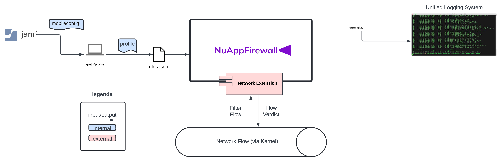
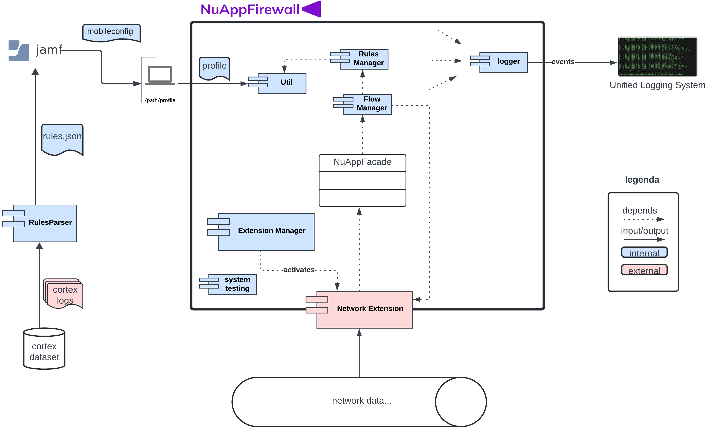
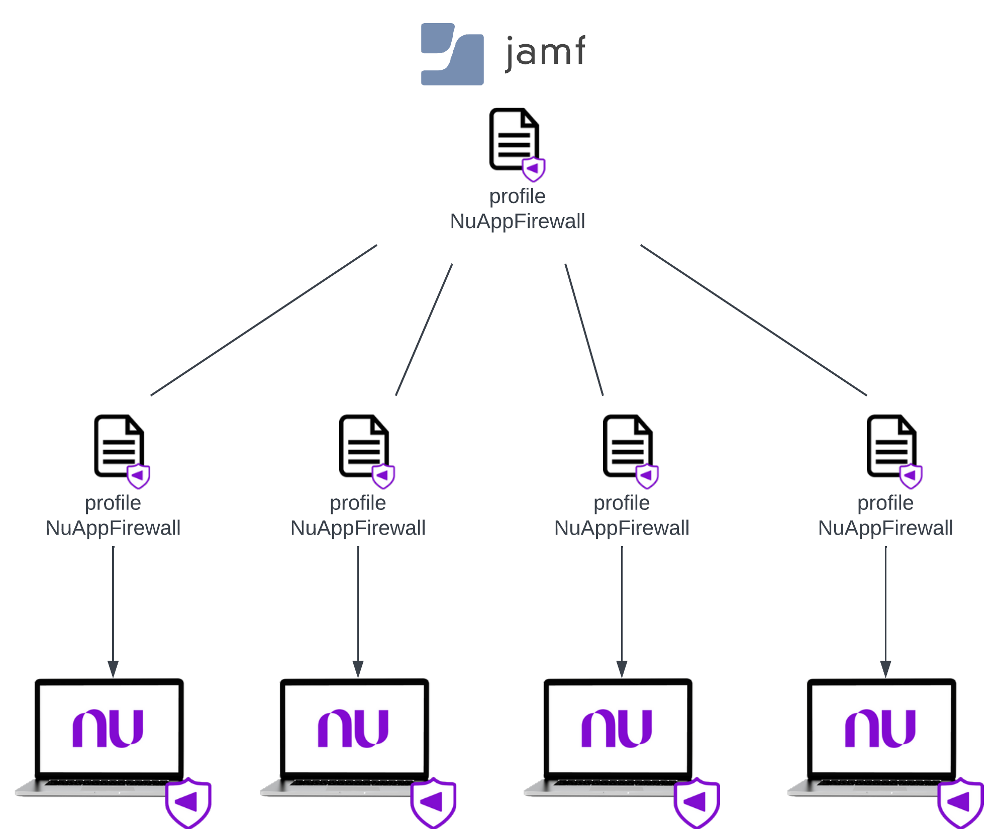

# **RFC: \[nufuturo ufcg\] AppFirewall**

# **Introdução**

**Contexto.** Para garantir a segurança das máquinas MacOS da Nubank, é essencial a utilização de firewalls para a filtragem de acessos de rede por aplicações, com regras de permissão e bloqueio estabelecidas pela própria organização.

**Problema.** As opções atualmente existentes no mercado não se adequam completamente a necessidade da Nubank, seja por serem de código proprietário, como o Little Snitch, ou de código aberto, mas pouco extensíveis, de difícil customização e configuração, como o LuLu. Além disso, ambas as soluções são voltadas para o uso pessoal de usuários ao invés de para um contexto corporativo, provisionado via perfis.

**Objetivo.** Para suprir tal necessidade, foi desenvolvido o NuAppFirewall, um *content filter* stand-alone para o MacOS. Com ela, em conjunto com o catálogo de regras desenvolvido a partir da análise dos logs do Córtex disponibilizados pela Nubank e deliberações com nosso Product Owner, podemos realizar a filtragem dos acessos de rede, bem como o monitoramento de acessos com e sem regras registradas no nosso catálogo.

# **Visões Arquiteturais (modelo c4)**

**Contexto.** A Figura 1 demonstra o diagrama de contexto do NuAppFirewall. Nela, é possível perceber que a aplicação recebe os eventos da rede com o Network Extension se comunicando com o Kernel, realiza o processamento a partir das regras que lê do arquivo localizado no path: */private/var/root/Library/Group Containers/{group-id}.com.nufuturo.nuappfirewall/rules.json*, onde group-id se refere ao id do grupo no Apple Developer, provisionado pelo perfil do Jamf, e retorna o veredito para o kernel, que permite ou bloqueia o acesso à rede do fluxo que foi capturado pelo filtro. Todos os eventos processados pela aplicação são registrados no Unified Logging System do MacOS.  

**Imagem 1: Diagrama de Contexto NuAppFirewall**

**Componentes.** No diagrama de componentes abaixo, podemos compreender o fluxo interno para a auditoria de um fluxo de rede.  
As regras da aplicação, como citadas anteriormente, são lidas pelo *Rules Manager* a partir de um arquivo json, que é provisionado por um perfil Jamf. As regras contidas neste json são provenientes do *Rules Parser*, que lê os logs do dataset do cortex disponibilizado pela Nubank e gera as regras que serão em seguida lidas pela aplicação.

A aplicação propriamente dita é iniciada pelo *Extension Manager*, que ativa o *Network Extension*, o qual atua como filtro de rede. A cada novo acesso, o fluxo de rede (Network Extension Filter Flow ou NEFilterFlow) é propagado para a fachada *NuAppFacade*, que por sua vez o redireciona para o *Flow Manager*. O *Flow Manager* então recupera as regras da aplicação que está tentando realizar o acesso, providas pelo *Rules Manager*, e verifica se existe ou não uma regra a ser aplicada para esse caso. 

Na versão atual, implementada no modo passive-allow, caso haja uma regra de permissão ou bloqueio para aquele fluxo capturado, temos o retorno equivalente a ação exprimida pela regra. Caso não haja uma regra, a aplicação permite o acesso, mas pelos logs é possível perceber que o acesso não foi concedido com um Rule ID equivalente a None.  
 
**Imagem 2: Diagrama de Componentes NuAppFirewall**

# **Decisões Arquiteturais**

**Network extension**  
O NuAppFirewall é constituído por dois targets principais, além do target de testes. Para evitar dependências cíclicas no processo de build da aplicação, optamos por manter apenas a inicialização da aplicação no target NuAppFirewall, e todas as outras partes, voltadas para a filtragem, de rede, são pertencentes ao target Extension. Além disso, todas elas fazem parte do target NuAppFirewallTests. Mais detalhes sobre esta decisão encontram-se na ADR: [target-adr](https://github.com/nufuturo-ufcg/nu-app-firewall/blob/main/docs/decisions/targets-adr.md).

**Sandbox**  
Utilizamos o Sandbox para containerizar a aplicação, mais detalhes na ADR: [sandbox-adr](https://github.com/nufuturo-ufcg/nu-app-firewall/blob/main/docs/decisions/sandbox-adr.md).

**Regras**

*As regras da aplicação hoje seguem um formato composto por:*

* ***ruleID:** String composta pela tripla: path da aplicação \+ endpoint de acesso \+ domínio do endpoint;*  
* ***action:** String que indica a ação a ser tomada quando encontra um match da regra \- podendo assumir os valores “block” ou “allow”;*  
* ***appLocation:** String que indica o path da aplicação*  
* ***endpoint:** String com o endpoint sendo acessado;*  
* ***port:** String com a porta sendo acessada*  
* ***Destination:** String com o par endpoint:port sendo acessado*

Para mais detalhes, consultar ADR: [rules-adr](https://github.com/nufuturo-ufcg/nu-app-firewall/blob/main/docs/decisions/rules-adr.md).

# **Plano de Implementação**

O plano de implementação do NuAppFirewall nas máquinas da Nubank envolve a utilização do Jamf para realizar o deploy do **profile**, da **aplicação** e do **conjunto de regras** para todos os dispositivos.

**Configuration Profile**  
Concede à aplicação o uso de *system extensions* necessários em sua instalação, permite o acesso à arquivos protegidos do computador e configura o NuAppFirewall como um *content filter* Firewall, o principal na ordem relativa de *filters* de um sistema.

**Policies**  
Realiza o deploy da aplicação NuAppFirewall e do conjunto de regras em formato .json para os todos os dispositivos. As regras recebem atualizações em seu conjunto, que será atualizado dinamicamente pela aplicação.

 
**Imagem 3: Distribuição do configuration profile NuAppFirewall via Jamf**  
A imagem 3 acima demonstra o plano de distribuição do profile do NuAppFirewall para as máquinas da Nubank.

