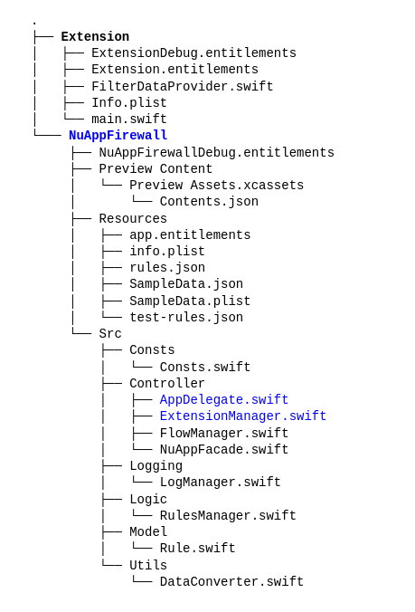

# Targets e Diretórios

## Contexto
O NuAppFirewall está dividido em dois diretórios principais: Extension e NuAppFirewall e o nosso build conta com dois targets de mesmos nomes. Entretanto, encontramos desafios por conta de dependencias ciclicas entre as classes dos dois targets.

## Decisão
Os arquivos não necessariamente pertencem ao target de mesmo nome do diretório principal em que se encontram. Mais especificamente, apenas os arquivos AppDelegate.swift e ExtensionManager.swift são pertencentes ao target NuAppFirewall, e funcionam como o inicializador da aplicação, enquanto que todos os outros arquivos pertencem ao target Extension, e são responsáveis pelo fluxo da aplicação propriamente dita.
A estrutura do código atualmente é:

## Alternativas consideradas
Foi considerado a geração de um terceiro target, de forma que todos os novos arquivos dentro do diretório NuAppFirewall pertenceriam a ele.  
Entretanto, isso ocasionaria em mais complexidade e na necessidade de criar mais um perfil com os entitlements adequados no Apple Developer, quando os existentes já solucionariam o problema.

## Consequências

### Positivas
Com essa organização dos targets, conseguimos resolver a dependência cíclica sem precisar criar mais um profile, e conseguimos ainda assim manter a organização dos diretórios que inicialmente estabelecemos.

### Negativas
Ter targets e diretórios com o mesmo nome, mas que não necessariamente coincidem em um arquivo (i.e. o arquivo **NuAppFirewall**/Src/Controller/FlowManager.swift, que pertence ao target **Extension**) pode causar confusão na criação de novas classes. O importante é lembrar que: caso você esteja criando uma nova classe ou estrutura. Muito provavelmente seu target deve ser **Extension**.

----
### Observações
É importante que os arquivos criados também pertençam ao target **NuAppFirewallTests** para que sejam criados e executados testes com as funcionalidades neles presentes.

